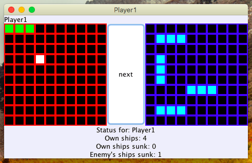

# Battleship Game
> Battleship Game in Java with State, MVC design patterns.



# Description
The game involves two grids(self and attack) positioned in JFrame. Self grid displays player's ships set in the beginning of the game. Attack grid displays the cells that the player attacked(green for hit and white for miss). Players take turns by clicking on the "Next" button that switches screens. Upon sunking the ship or winning the match, player will be displayed with congratulations pop-up message. Because of state design pattern player cannot fire more than once per turn nor player can add ships after setting them up in the beginning of the game.

* 5 Ships max per plays
* 3 cells max per ship
* Design patterns used: MVC, State
* GUI Framework: Swing

## Usage

Terminal:

```sh
cd out/artifacts/Battleship_jar
java -jar Battleship.jar
```

GUI: 

Click on the executable JAR.

```sh
cd out/artifacts/Battleship_jar/Battleship.jar
```
## Meta

Danil Kolesnikov – danil.kolesnikov@sjsu.edu

Distributed under the MIT license.
